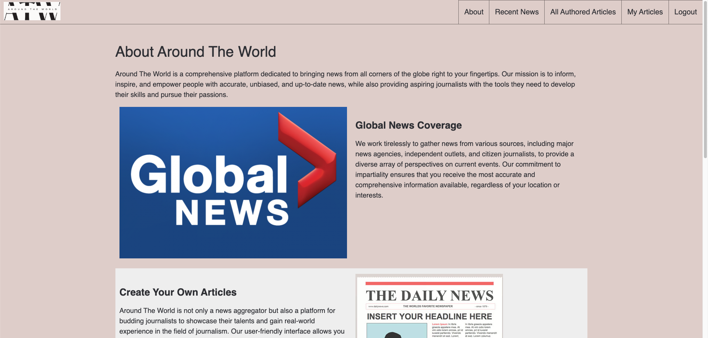
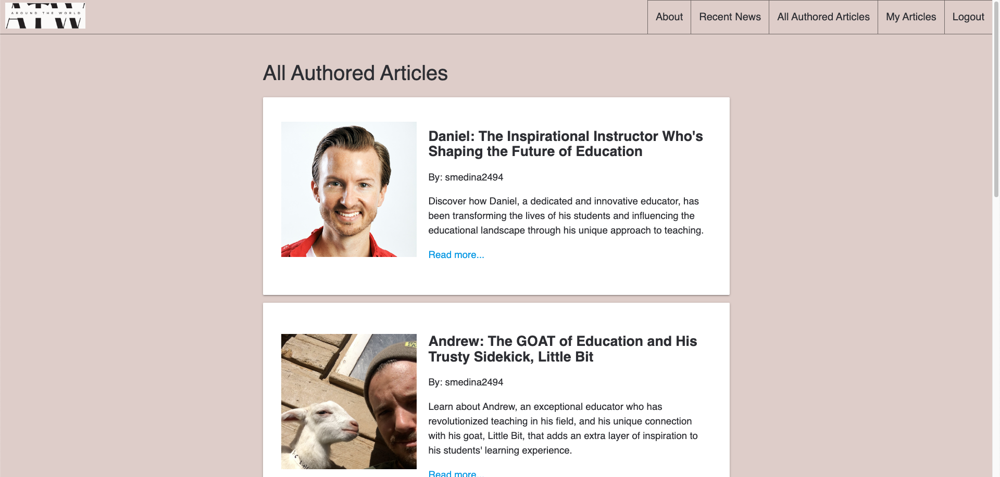
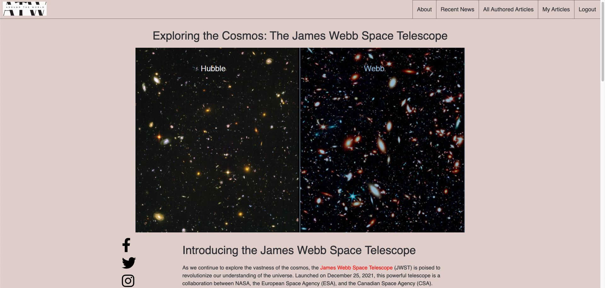
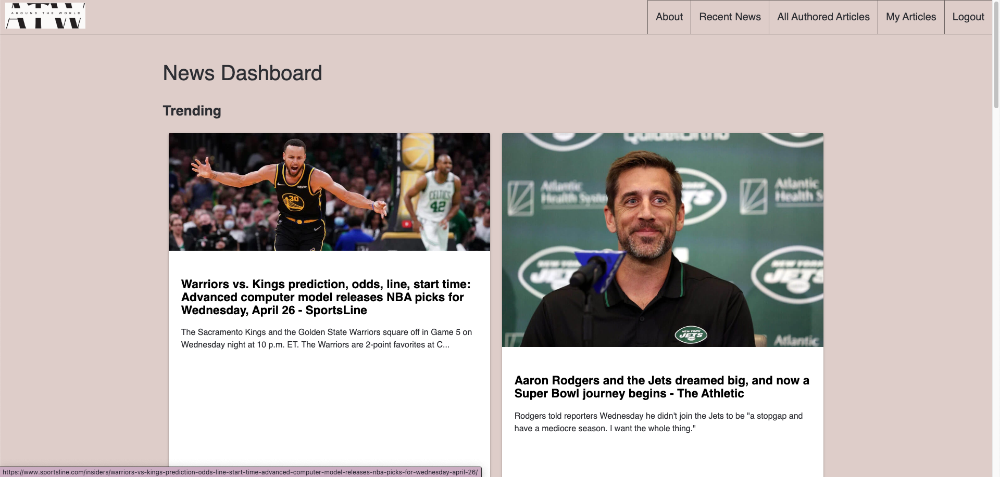

# Around The World

## Summary

This application is about news and articles. It provides access to a page that makes an API call to display recent top headlines, some information about them, and links to them. There is also an option for users to create their own custom articles, and even includes a rich text editor. Users can also see other user created articles as if they had their own little news community.

## Technologies Used

- HTML
- Custom CSS Combined With Materialize
- JavaScript
- NEWS.API
- Django
- Heroku
- PostgreSQL

## Screenshot

## Getting Started

[Link to Around The World](https://around-the-world.herokuapp.com/)

## Future Enhancements

- Allow a mechanism for users to save/favorite news articles.
- Add a secondary navigation to the News.API page that has options to different categories or differnet general regions.
